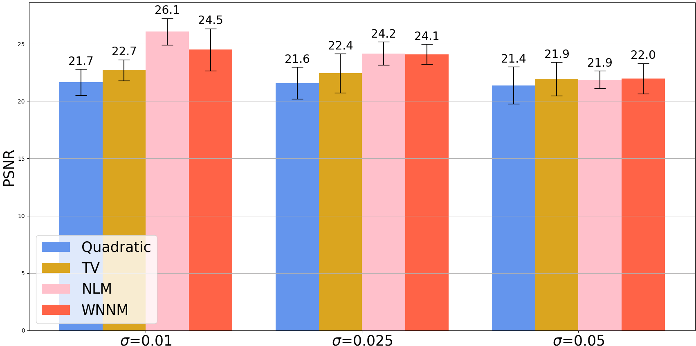
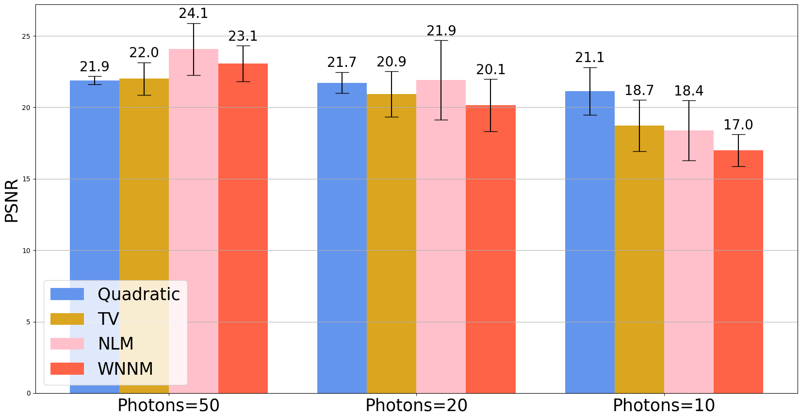

# Image Denoising
In this experiment we test different image denoising techniques through the lens of convex optimization. Specifically, we test a quadratic filter, a total-variation filter, the non-local means approach, and the non-local weighted nuclear norm minimization approach. We benchmark these approaches against 5 images from the [University of Southern California's image database](https://sipi.usc.edu/database/database.php?volume=misc) (specifically aerial, boat, bridge, clock, and couple), when these images have been corrupted by additive zero-mean Gaussian noise and Poisson noise. Our [final report](image_denoising_report.pdf) explains in further detail our approach, the math behind it, and the references used. 

## Installation

### Clone repo
```bash
git clone https://github.com/Federico-PizarroBejarano/image_denoising.git
cd image_denoising
```

### Create a Conda Environment
Create and access a Python 3.8 environment using
[`conda`](https://docs.conda.io/projects/conda/en/latest/user-guide/install/index.html)

```bash
conda create -n denoise python=3.8.10
conda activate denoise
```

Install the `image_denoising` repository

```
pip install --upgrade pip
pip install -r requirements.txt
```

### Install Mosek
Obtain [MOSEK's license](https://www.mosek.com/products/academic-licenses/) (free for academia).
Once you have received (via e-mail) and downloaded the license to your own `~/Downloads` folder, install it by executing
```
$ mkdir ~/mosek                                                    # Create MOSEK license folder in your home '~'
$ mv ~/Downloads/mosek.lic ~/mosek/                                # Copy the downloaded MOSEK license to '~/mosek/'
```

## Denoising Techniques
Consider a greyscale image Y. We are looking for a denoised image X. We have implemented the following techniques:
- **Quadratic Filtering:** Solve the optimization

    min<sub>X</sub> ||X - Y||<sub>sq</sub> + &lambda; ||&nabla;X||<sub>sq</sub>

    where ||X||<sub>sq</sub> is the sum-of-squares norm, and &nabla;X is the gradient of the image X.

- **Total Variation (TV) Filtering:** Solve the optimization

    min<sub>X</sub> ||X - Y||<sub>1</sub> + &lambda; ||X||<sub>TV</sub>

    where ||X||<sub>TV</sub> is the total-variation operator.

- **Non-Local Means (NLM) Filtering:** Denoising every pixel by making it a weighted average of every other pixel in the image, weighted by the similarity between the patches around the two pixels.

- **Non-Local Weighted Nuclear Norm Minimization (WNNM):** Finding similar patches to every patch in the image and using a weighted nuclear norm minimization to remove noisy singular values using a quadratic program.

## Optimization Techniques
Quadratic filtering and TV filtering are bicriteria optimizations since they have two different objectives. To solve this, we have implemented the primal-dual algorithm, and compared this approach with the out-of-the-box convex optimization provided by <tt>cvxpy</tt>.

## Testing
We compare the various approaches with additive white Gaussian noise (zero-mean but known variance) and Poisson noise (varying photon availability). We compare the efficacy of the approaches both qualitatively, and using the peak signal-to-noise ratio (PSNR). The original test images can be found in [images](images) and the pickled results and images can be found in [results](results).

The final results for additive white Gaussian noise are:




The final results for Poisson noise are:


